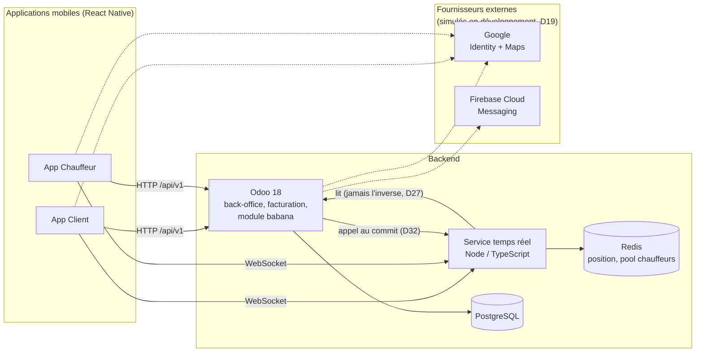

# babana.cm

Application de moto-taxi pour Douala (Cameroun) : un client demande une course depuis son
téléphone, choisit son chauffeur parmi les plus proches, suit la course en direct, paie en
espèces à l'arrivée. Un back-office Odoo porte l'administration, la facturation et le compte
courant des chauffeurs.

Ce document est un point d'entrée. Il ne remplace ni `CLAUDE.md` (le protocole de travail) ni
`amoa/` (les décisions et spécifications) — il indique où trouver l'un et l'autre.

---

## Où se trouve quoi

```
babana.cm/
├── CLAUDE.md          # Protocole de travail : comment on développe ici, lu à chaque session
├── amoa/              # Maîtrise d'ouvrage : décisions, spécifications, comptes rendus. En lecture.
│   ├── 01-architecture.md … 05-prerequis-et-simulation.md   # décisions D1…Dn, argumentées
│   ├── specs/         # une spécification par tâche de développement
│   ├── questions/      # écarts entre une spécification et ce que le code a révélé
│   └── rapport-nuit-*.md   # journal de chaque session de développement
└── code/              # Tout le code : le monorepo, avec son propre Makefile
```

**`amoa/` est la documentation de référence du projet** : le pourquoi de chaque choix
d'architecture (`01-architecture.md`), la comparaison des fournisseurs de cartographie
(`02-comparatif-cartographie.md`), le découpage en tâches (`03-decoupage-taches.md`),
l'organisation du monorepo (`04-monorepo-et-services.md`), les prérequis et services simulés
(`05-prerequis-et-simulation.md`), et une spécification détaillée par tâche dans `amoa/specs/`.
C'est là qu'il faut chercher *pourquoi* une chose est faite comme elle l'est, avant de supposer
qu'elle est faite au hasard.

## Architecture, en bref

| Composant | Rôle |
|---|---|
| `code/apps/client`, `code/apps/driver` | Deux applications **React Native** distinctes (client, chauffeur), code partagé via des paquets communs |
| `code/services/odoo` | **Odoo 18 Community**, auto-hébergé : back-office, facturation, compte courant, module métier `babana` |
| `code/services/realtime` | Service **Node/TypeScript** dédié : GPS, dispatch, WebSocket — jamais de client PostgreSQL, jamais de règle métier |
| Redis | Position des chauffeurs, pool des chauffeurs disponibles (réservation atomique par script unique) |
| PostgreSQL | Base d'Odoo |
| `code/packages/*` | Contrats partagés (`@babana/contracts`), client API, client temps réel, abstraction carte (`@babana/maps`) |



`services/realtime` ne possède aucune donnée durable (corollaire de l'invariant 1, voir plus bas)
et ne dépend d'aucun paquet de `apps/*` — c'est pour ça que la flèche Odoo → Redis n'existe pas :
Odoo n'écrit jamais dans Redis, il appelle le service temps réel au commit de sa transaction, qui
seul écrit le pool des chauffeurs disponibles (D26, D27, D32).

Deux invariants à connaître avant de lire le code : **une écriture Odoo par événement métier,
jamais par tick GPS** (le service temps réel ne possède aucune donnée durable), et **les
transitions sont les seules portes d'écriture sur une course** (aucune écriture directe de
`state`). Les cinq invariants complets sont dans `CLAUDE.md`.

Toutes les décisions d'architecture (D1 à D76 à ce jour) sont numérotées et argumentées dans
`amoa/01-architecture.md` §1 — une table à parcourir avant de proposer un changement structurant.

## Comment démarrer sur ce projet

1. Lire `CLAUDE.md` en entier — c'est le protocole de travail : organisation du dépôt, les cinq
   invariants, les conventions de nommage et de branche, la définition de "fini", le protocole
   d'écart (que faire quand une spécification semble fausse ou contradictoire).
2. Repérer la spécification de la tâche à traiter dans `amoa/specs/`, et lire les décisions
   d'architecture qu'elle touche dans `amoa/01-architecture.md`.
3. Une branche par tâche, nommée d'après son identifiant (`L3-06-atomic-reservation`) ; message de
   commit préfixé du même identifiant.
4. Une tâche n'est finie que si `make test` passe **en entier** (pas seulement les tests de la
   tâche), pas seulement ceux qu'on vient d'écrire — voir la définition de fini dans `CLAUDE.md`.

## Faire tourner le projet en local

Tout se pilote depuis `code/`, et fonctionne **sans aucun compte externe** — les dépendances
tierces (Google, SMTP, stockage) sont simulées par défaut.

```bash
cd code/
cp infra/env/.env.example infra/env/.env   # fait aussi automatiquement par `make up`
make up          # démarre toute l'infrastructure (Docker Compose)
make seed         # jeu de données de démonstration
make test         # suite complète (Odoo + TypeScript)
```

Une fois `make up` lancé :

| Service | Adresse |
|---|---|
| Odoo (accès direct) | http://localhost:8069 |
| API | https://api.localhost |
| Back-office | https://admin.localhost |
| MinIO (stockage) | http://localhost:9001 |
| Mailpit (emails de test) | http://localhost:8025 |

Autres commandes utiles : `make down`, `make reset` (arrête et efface les données — base
jetable, à faire régulièrement), `make logs`, `make lint`, `make client` / `make driver`
(bundlers React Native), `make client-web` (export web du Client), `make verify` (vérifications
de bout en bout), `make secrets-scan`. Détail complet : `code/Makefile` et
`code/infra/env/README.md` (rôle de chaque variable d'environnement).

## Utiliser Claude Code sur ce dépôt

`CLAUDE.md`, à la racine, est chargé automatiquement à chaque session Claude Code lancée depuis
ce dépôt — inutile de le coller dans un prompt. Il fixe la façon de travailler ici (une tâche à
la fois, protocole d'écart, définition de fini, invariants) ; le *quoi* reste entièrement dans
`amoa/specs/`.

Quelques repères propres à ce projet :

- **`amoa/` ne se modifie jamais depuis une session de développement**, à deux exceptions
  près : déposer un écart dans `amoa/questions/` quand une spécification semble fausse ou
  incomplète, et corriger une spécification si on me l'a explicitement demandé. Une session qui
  réécrit `amoa/` en silence pour arranger le code annule l'intérêt du protocole d'écart.
- **Chaque session de nuit** écrit son propre `amoa/rapport-nuit-JN.md` — l'état de la session,
  pas une documentation a posteriori. C'est le premier document à lire pour reprendre un travail
  interrompu.
- Les frontières listées dans `CLAUDE.md` (aucun SDK de carte hors de `@babana/maps`, aucun
  client PostgreSQL dans `services/realtime`, etc.) sont vérifiées par `make lint` — un lint qui
  échoue vaut mieux qu'une revue qui oublie.
- `L3-06`/`L3-13` (réservation atomique), le lot `L5` (logique financière), `L8-01`/`L8-02`
  (habilitations) et `L4-02` (machine à états) ne se fusionnent pas sans revue humaine — un
  défaut y est intermittent ou invisible en test unitaire.
